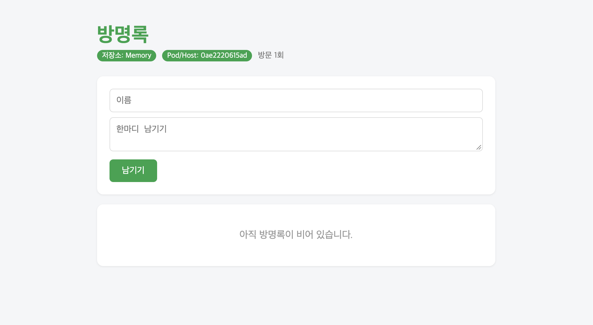

# week06 - Dockerfile & ghcr.io 배포

## 1. 내 이미지 주소

```bash
docker pull ghcr.io/suhyun725/guestbook:v2
```

## 2. 친구 이미지를 실행한 결과 캡처



## 3. Dockerfile의 각 줄이 하는 일

```dockerfile
FROM python:3.12-slim
```
- 파이썬 3.12 슬림 버전 이미지를 베이스로 사용합니다.

```dockerfile
WORKDIR /app
```
- 컨테이너 안의 작업 디렉터리를 `/app`으로 설정합니다. 이후 명령은 이 폴더 기준으로 실행됩니다.

```dockerfile
COPY requirements.txt .
```
- `requirements.txt`만 먼저 `/app`으로 복사합니다. 의존성 파일을 따로 복사해 두면 소스 코드만 바뀔 때 아래 설치 단계의 빌드 캐시를 재사용할 수 있습니다.

```dockerfile
RUN pip install --no-cache-dir -r requirements.txt
```
- `requirements.txt`에 적힌 라이브러리를 설치합니다. `--no-cache-dir` 옵션으로 pip 캐시를 남기지 않아 이미지 크기가 줄어듭니다.

```dockerfile
COPY . .
```
- 나머지 소스 코드를 모두 `/app`으로 복사합니다.

```dockerfile
RUN useradd -m appuser
```
- 보안을 위해 root가 아닌 일반 사용자 `appuser`를 생성합니다.

```dockerfile
USER appuser
```
- 이후 명령과 컨테이너 실행을 `appuser` 권한으로 전환합니다.

```dockerfile
ENV APP_TITLE="InhaTC DevOps 202244091 고수현 방명록" \
    THEME_COLOR="#0054A6"
```
- 앱이 사용할 기본 환경변수(방명록 제목, 테마 색상)를 설정합니다.

```dockerfile
EXPOSE 5000
```
- 컨테이너가 5000번 포트를 사용한다는 것을 명시합니다. 문서화 목적이며, 실제 포트 연결은 `docker run -p`로 합니다.

```dockerfile
CMD ["python", "app.py"]
```
- 컨테이너가 시작될 때 실행할 기본 명령어입니다.

## 4. 빌드 캐시가 동작한 로그 (CACHED)

```
 => CACHED [2/6] WORKDIR /app                                              0.0s
 => CACHED [3/6] COPY requirements.txt .                                   0.0s
 => CACHED [4/6] RUN pip install --no-cache-dir -r requirements.txt        0.0s
```

| 구분 | 1. 코드 직접 작성 (Hardcoding) | 2. Dockerfile `ENV` | 3. 실행 시 `-e` 옵션 |
| :--- | :--- | :--- | :--- |
| **설정 위치** | `app.py` 등 소스 코드 내부 | `Dockerfile` 내부 | `docker run -e` 실행 명령어 |
| **변경 방식** | 코드 수정 후 **이미지 재빌드** | Dockerfile 수정 후 **이미지 재빌드** | **재빌드 없이** 명령어로 즉시 변경 |
| **우선순위** | 가장 낮음 | 중간 | **가장 높음** (`ENV` 값을 덮어씀) |
| **보안성** | 매우 취약 (Git에 유출 위험) | 취약 (`docker history`/`inspect`로 노출됨) | 상대적으로 안전 (소스/이미지에 남지 않음) |
| **주요 용도** | 절대 변경되지 않는 내부 로직용 | 애플리케이션의 **기본값 (Default)** | 환경별(개발/운영) 설정 및 **비밀키/비밀번호** |

### 예시

```bash
# ENV 기본값으로 실행
docker run -p 5000:5000 ghcr.io/suhyun725/guestbook:v2

# -e 옵션으로 ENV 값을 덮어쓰기
docker run -p 5000:5000 -e APP_TITLE="새 제목" -e THEME_COLOR="#FF0000" ghcr.io/suhyun725/guestbook:v2
```
